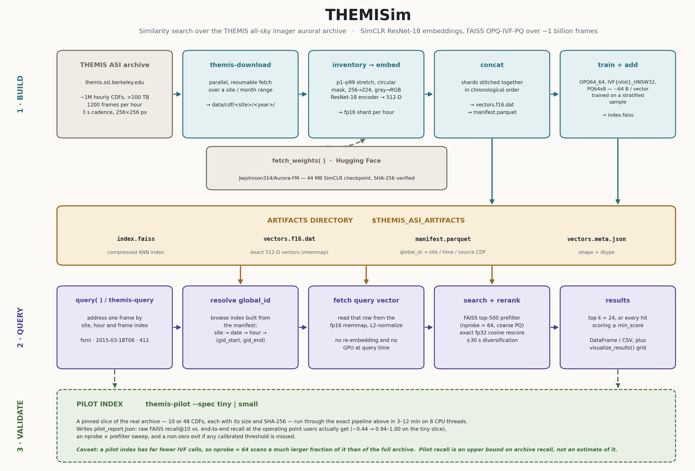

themisim
========

Similarity search over `THEMIS <https://themis.ssl.berkeley.edu>`_ all-sky
imager (ASI) auroral imagery. A SimCLR-trained ResNet-18 encoder turns each
256×256 frame into a 512-D feature vector whose cosine proximity tracks visual
and morphological similarity rather than pixel-level identity; those vectors are
indexed with FAISS (OPQ-IVF-PQ). Given any indexed frame, ``themisim`` returns
the most visually similar frames across the archive.

Architecture
------------

**Build** embeds every 256×256 frame through the SimCLR encoder into a 512-D
vector, stitches the per-hour fp16 shards into one memmap in chronological
order, and trains an ``OPQ64_64,IVF{nlist}_HNSW32,PQ64x8`` index on a stratified
sample — about 64 bytes per compressed vector.

**Artifacts** are the four files every query needs. Because ``global_id`` is the
memmap row index and shards are concatenated in site-then-time order, each site
occupies one contiguous block, which is the property the filtered-query fast
path relies on.

**Query** addresses a frame by ``(site, hour, frame)`` and reads its stored
vector straight from the memmap — nothing is re-embedded and no GPU is needed —
then pulls a coarse candidate pool from the compressed index and rescores it
*exactly* in fp32. The approximate step decides what can be found; the exact
step decides the order. See :doc:`benchmark`.

**Validate** is the pilot path, described in :doc:`pilot`. Note the caveat on
the diagram: a pilot index has far fewer IVF cells, so the same ``nprobe`` scans
a much larger fraction of it, and pilot recall is an upper bound on archive
recall rather than an estimate of it.

.. toctree::
   :maxdepth: 2
   :caption: Contents

   quickstart
   pilot
   benchmark
   api

Installation
------------

.. code-block:: bash

   pip install themisim

``faiss-cpu`` is pulled in automatically (the query path is CPU-only). A
CUDA-enabled PyTorch speeds up index building but is optional — every stage
falls back to CPU.

Indices and tables
------------------

* :ref:`genindex`
* :ref:`modindex`
* :ref:`search`
